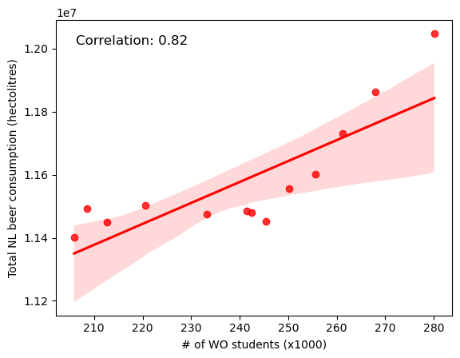

Solution_RikvanRhee.md - Rik van Rhee - 14154366

 - Fantastic yeasts and where to find them: the hidden diversity of dimorphic fungal pathogens
 - An analysis of the forces required to drag sheep over various surfaces
 - The neurocognitive effects of alcohol on adolescents and college students

There does seem to be a correlation between the number of students and beer consumption. This does not directly mean that it is a causation, as we can also see a correlation between beer consumption and the year, and there is a causation between the number of students and the year. The correlation is thus probably caused by other factors, like the population increase, or other factors.